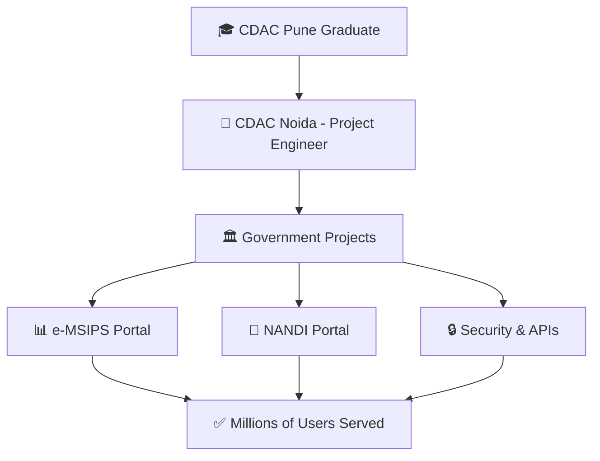

# <div align="center">

</div>

<div align="center">
  
[](https://git.io/typing-svg)

</div>

---

##  **About Me**


```yaml
name: Jinesh Dutt Joshi
role: Full Stack Developer & Problem Solver
company: CDAC Noida
position: Project Engineer
experience: 4+ years
location: India
motto: "Code. Innovate. Deliver."
```

- 🎓 **PGDAC** from **CDAC Pune (2022)** | **B.Tech** in Computer Science (2018)
- 💼 **4+ years** building **enterprise-grade applications** for **Government of India** projects
- 🏛️ Working on **MeitY & DAHD** projects with millions of users
- 🛠️ Specialized in **secure APIs**, **microservices**, and **scalable architectures**
- 🔐 Security-focused developer with **Burp Suite** expertise
- 🤖 **AI/Chatbot integration** enthusiast
- 📊 **Data visualization** and **reporting solutions** expert

---

##  **Tech Stack**

<div align="center">

### 🚀 **Languages & Core**


### 🎨 **Frontend Technologies**


### ⚙️ **Backend & Frameworks**


### 🗄️ **Databases**


### ☁️ **DevOps & Cloud**


### 🛠️ **Tools & Others**


</div>

---

## 🏆 **Featured Projects & Achievements**

<div align="center">

| 🎯 **Project** | 💡 **Description** | 🔧 **Tech Stack** |
|---|---|---|
| **🏛️ e-MSIPS Portal** | Online application management system for MeitY | `Spring Boot` `PostgreSQL` `React` |
| **🤖 AI Chatbot Integration** | Intelligent query handling system | `Java` `NLP` `REST APIs` |
| **📊 NANDI Portal** | Veterinary approval system for DAHD | `Microservices` `Docker` `AWS` |
| **🔗 Database Integration** | Multi-DB integration with DBLINK | `PostgreSQL` `Performance Tuning` |
| **📋 PDF Reporting Engine** | Dynamic report generation system | `JasperReports` `Java` `REST` |

</div>

---

## 📊 **GitHub Analytics**

<div align="center">
  
  
</div>

<div align="center">
  
</div>

<div align="center">
  
</div>

---

## 🎯 **Experience Highlights**

<div align="center">



</div>

**🚀 Key Achievements:**
- 📈 **Scaled applications** serving **millions of government beneficiaries**
- 🔐 **Implemented robust security** measures with penetration testing
- 🤖 **Pioneered chatbot integration** improving user engagement by 60%
- ⚡ **Optimized database performance** reducing query time by 40%
- 🏆 **Delivered 5+ enterprise projects** on time and within budget

---

## 🌟 **Skills Matrix**

<div align="center">

| **Category** | **Skills** | **Proficiency** |
|:---:|:---:|:---:|
| **Backend Development** | Java, Spring Boot, Microservices | ⭐⭐⭐⭐⭐ |
| **Frontend Development** | React, JavaScript, HTML/CSS | ⭐⭐⭐⭐⭐ |
| **Database Management** | PostgreSQL, MySQL, MongoDB | ⭐⭐⭐⭐⭐ |
| **Cloud & DevOps** | AWS, Docker, Kubernetes | ⭐⭐⭐⭐ |
| **Security & Testing** | Burp Suite, JUnit, API Testing | ⭐⭐⭐⭐ |

</div>

---

## 🎨 **Current Focus**

<div align="center">

```javascript
const jinesh = {
    currentlyWorking: "Enterprise Government Solutions",
    learningNext: ["Kubernetes Advanced", "Spring Cloud", "React Native"],
    askMeAbout: ["Java", "Spring Boot", "System Design", "Government Tech"],
    funFact: "I've built systems that process millions of government applications! 🏛️"
};
```

</div>

---

## 📬 **Let's Connect!**

<div align="center">

[](mailto:jinesh3715@gmail.com)
[](https://www.linkedin.com/in/jinesh-dutt-joshi-016b50177)
[](#)

</div>

---

<div align="center">
  
  
  **⭐ "Building the future, one commit at a time!" ⭐**
  
  
</div>
